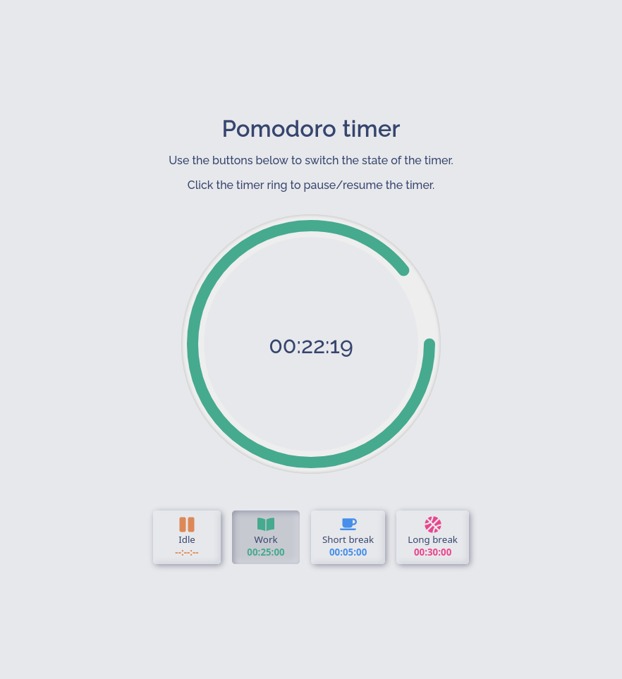
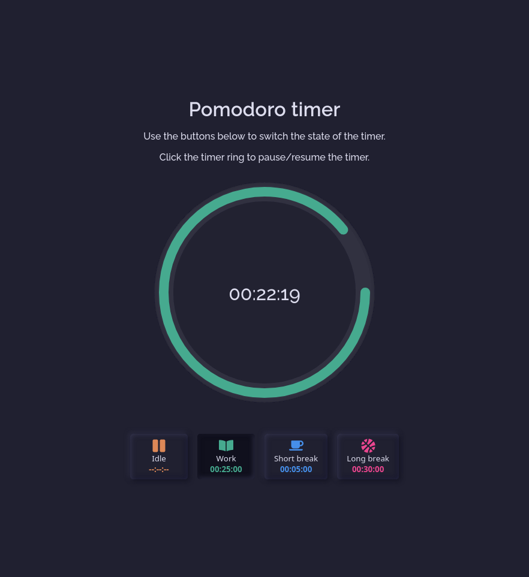

# Pomodoro timer app
|Day|Night|
|---|---|
|||
## To do
- [ ] Night mode toggle
- [ ] Customizable durations
- [ ] Session history
- [ ] Saving and loading multiple duration settings 

## Credits
- **Sound effects**
  - **name**: 50 Menu Interface SFX
  - **source**: https://coloralpha.itch.io/50-menu-interface-sfx
  - **author**: ColorAlpha
  - **license**: [Creative Commons Attribution v4.0 International](https://creativecommons.org/licenses/by/4.0/)
- **Font**
  - **name**: Raleway
  - **source**: https://fonts.google.com/specimen/Raleway/about
  - **authors**: Matt McInerney, Pablo Impallari, Rodrigo Fuenzalida
  - **license**: Open Font License
